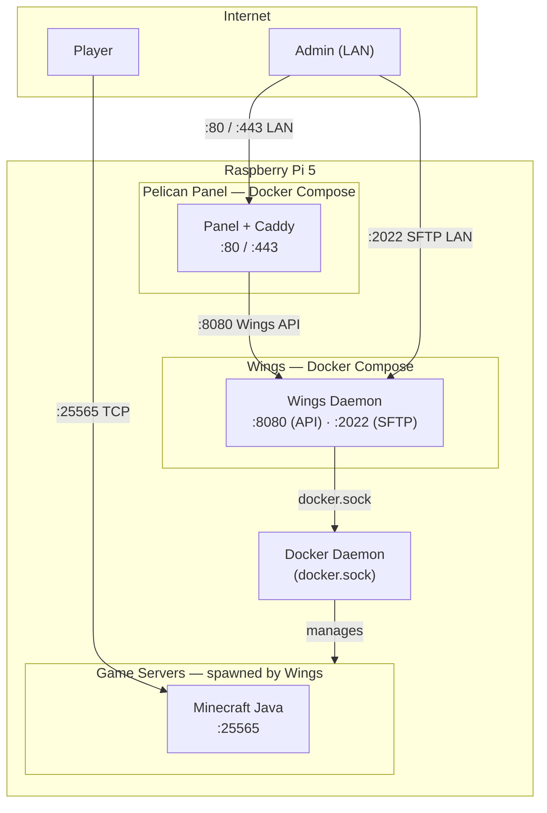

# Self-Hosted Game Server Management with Pelican

Self-hosted game server management on a **Raspberry Pi 5 (ARM64)** using [Pelican Panel](https://pelican.dev). Pelican handles provisioning, configuration, and lifecycle of game servers — each running as an isolated Docker container managed by Wings.

> ⚠️ **ARM64 Notice:** This entire stack runs on `linux/arm64`. Wings is currently in **experimental ARM64 status**.

---

## Stack

| Component         | Technology                      | ARM64 Status    |
|-------------------|---------------------------------|-----------------|
| Host OS           | Raspberry Pi OS Bookworm 64-bit | Native          |
| Container Runtime | Docker Engine                   | Official        |
| Reverse Proxy     | Caddy (bundled with Panel)      | Official        |
| Panel             | Pelican Panel (Docker Compose)  | Official        |
| Daemon            | Wings (Docker Compose)          | ⚠️ Experimental |
| Firewall          | ufw                             | Native          |

---

## Architecture

Panel and Wings run on the same Pi. Panel is the web UI for managing game servers. Wings is the daemon that actually creates and controls game server containers via the Docker socket. Panel talks to Wings over the local Wings API.

Only `:25565` is forwarded on the router. Panel, Wings API, and SFTP are reachable only from the local network.

See [Security](docs/security.md) for the full port table and threat model.

---

## Setup

All setup steps are documented in order. Each guide is self-contained and assumes the previous steps are done.

### Prerequisites

- Raspberry Pi 5 with Raspberry Pi OS Bookworm 64-bit freshly installed
- SSH access to the Pi
- A machine on the same local network to access the Panel UI

### Guides

| Step | Guide | What it does |
|------|-------|--------------|
| 1 | [OS Hardening](docs/setup/01-os-hardening.md) | Configures ufw firewall rules — run this first before exposing any ports |
| 2 | [Docker](docs/setup/02-docker.md) | Installs Docker Engine, adds your user to the `docker` group |
| 3 | [Pelican Panel](docs/setup/03-pelican-panel.md) | Starts the Panel via Docker Compose, runs the web installer, saves the App Key |
| 4 | [Wings](docs/setup/04-wings.md) | Starts Wings via Docker Compose, connects it to the Panel by pasting the node config |
| 5 | [First Server](docs/setup/05-first-server.md) | How to import an Egg and create a game server in the Panel |
| 6 | [Minecraft Vanilla](docs/setup/06-minecraft-vanilla.md) | Vanilla Minecraft setup, EULA, and port forwarding for public access |

After step 4, Wings will appear as an online node in the Panel and you can create game servers.

---

## Disclaimer

This project is a personal homelab setup and is operated entirely at your own risk. There are no guarantees regarding security, availability, or data integrity. You are responsible for securing your network, keeping software up to date, and ensuring that your setup complies with any applicable laws and regulations.

---

## License

MIT — see [LICENSE](LICENSE).