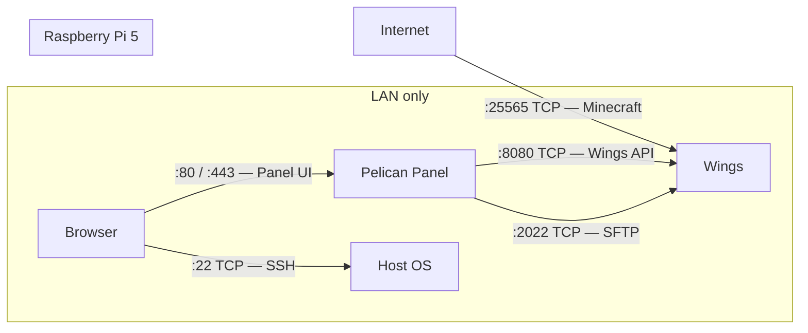

# Security

## Port Overview

All ports that Docker or the host exposes, and who can reach them.

| Port | Protocol | Service | Reachable from | Notes |
|------|----------|---------|----------------|-------|
| 22 | TCP | SSH | LAN | UFW rule: `allow ssh` — not forwarded on router |
| 80 | TCP | Pelican Panel (HTTP) | LAN | Caddy — redirects to HTTPS or serves HTTP depending on `APP_URL` |
| 443 | TCP | Pelican Panel (HTTPS) | LAN / Internet | Only internet-reachable if you forward it on the router |
| 8080 | TCP | Wings API | LAN (single-Pi) / Panel IP only (two-Pi) | Panel talks to Wings over this port. Must never be publicly reachable. |
| 2022 | TCP | Wings SFTP | LAN only | UFW rule: `allow from <LOCAL_SUBNET>` |
| 25565 | TCP | Minecraft Java | Internet | Only game server port that is publicly forwarded via router |

> The table above reflects the single-Pi setup. See [01-os-hardening.md](setup/01-os-hardening.md) for two-Pi UFW rules.

UFW default policy is `deny incoming` — ports not listed above are blocked at the OS level.

---

## Wings and the Docker Socket

Wings is granted access to the host Docker daemon by mounting the Unix socket:

```yaml
volumes:
  - /var/run/docker.sock:/var/run/docker.sock
```

### What this means

`/var/run/docker.sock` is the control interface of the Docker daemon. Any process that can read/write this socket can:

- Start, stop, and delete any container on the host
- Mount host paths into new containers (including `/`)
- Escape the container and gain effective **root access on the host**

This is intentional — Wings needs to spin up and manage game server containers dynamically on behalf of the Panel. There is no way around this for Wings to function.

### Why this is acceptable here

- Wings is an official Pelican project, not third-party software
- The Wings API (`:8080`) is **LAN-only** and blocked by UFW — an external attacker cannot reach it
- The Panel, which issues commands to Wings, is also LAN-only in the default setup
- The Pi runs a single-purpose workload; no other users or services share the host

### What would make this dangerous

- Exposing the Wings API (`:8080`) to the internet without authentication in front of it
- Running other untrusted workloads on the same host that could reach `docker.sock`
- Adding other users to the `docker` group on the host (equivalent to giving them root)

---

## Attack Surface Summary



The only public entry point for game traffic is `:25565`. Everything else stays inside the local network.